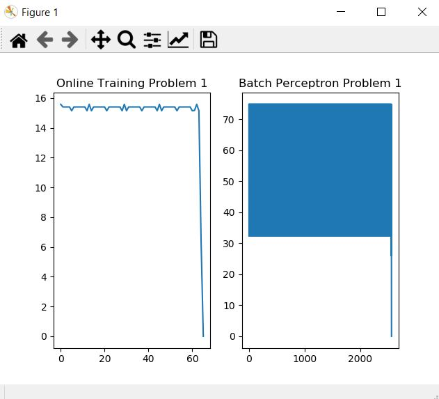
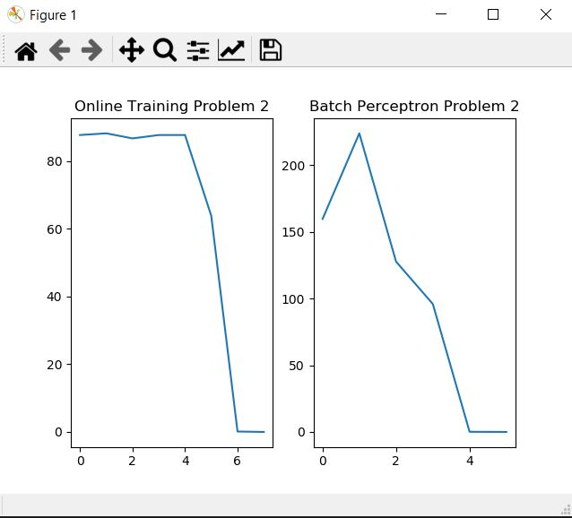
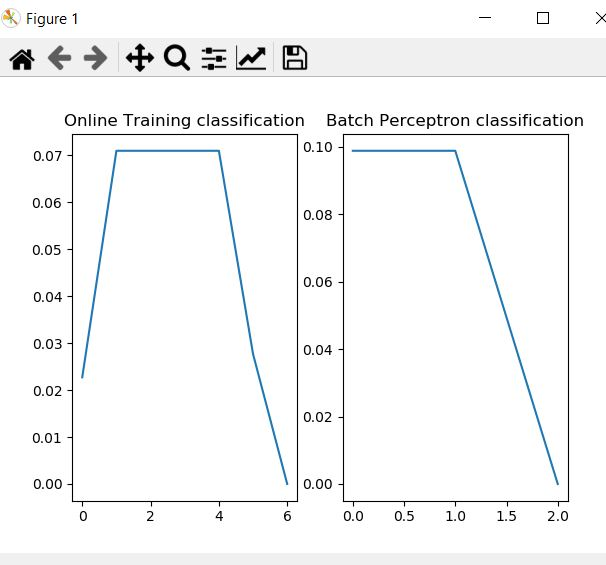
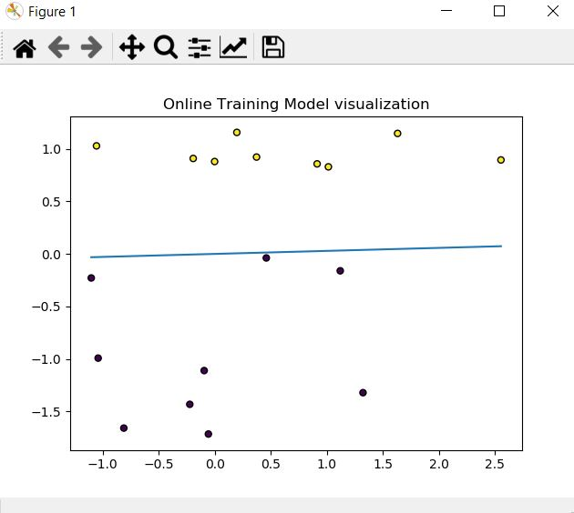
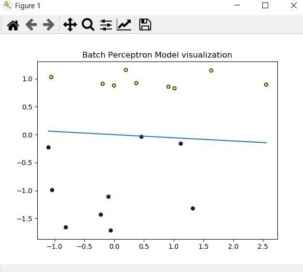
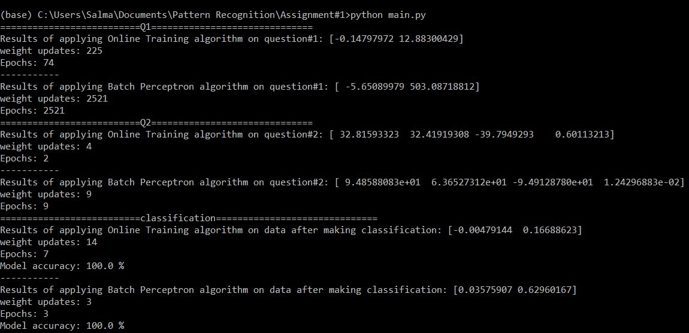

# Assignment#1 HEMN451

## Team Members:

Ahmed Helmy Ahmed 1170539

Salma Atia Ahmed 1170211

## Code Description:

The code implements two algorithms: Online Training and Batch Perceptron. The two algorithms are implemented on the input is sheet3 problems 1 and 4. Each problem has it's own function that calls the two algorithms and print the output to compare between them. Every algorithms outputs the weights array, number of times each algorithm updated model weights, number of epochs needed to achieve almost zero error and changes in weights (to be plotted later). The two problems call the algorithms with a bias included.

The two algorithms are then implemented on the data from classification in the assignment description without adding a bias. train_test_split() function is used 75% as training data and 25% as testing data.The generated data is then plotted, visualized and the model accuracy is calculated .

### Batch Perceptron Algorithm:

The Perceptron is inspired by the information processing of a single neural cell called a neuron.

A neuron accepts input signals via its dendrites, which pass the electrical signal down to the cell body.

In a similar way, the Perceptron receives input signals from examples of training data that we weight and combined in a linear equation called the activation.

The activation is then transformed into an output value or prediction using a transfer function, such as the step transfer function.

It is closely related to linear regression and logistic regression that make predictions in a similar way (e.g. a weighted sum of inputs).

The weights of the Perceptron algorithm must be estimated from the training data using stochastic gradient descent.

### Online Training Algorithm:

The online training method is close to the perceptron method. The diffrence is that it for every loop, if y(W.X) <=0 the delta value is decreased by the amount of (y.x). The weight is then decreased by the new value of delta over the length of the input.

### Output:

Problem 1 comparison between the two algorithms

Problem 2 comparison between the two algorithms

Output of classified data after implementing the two algorithms

Output of modeling the classified data after implementing online training algroithm

Output of modeling the classified data after implementing batch perceptron algroithm

General output of the code

